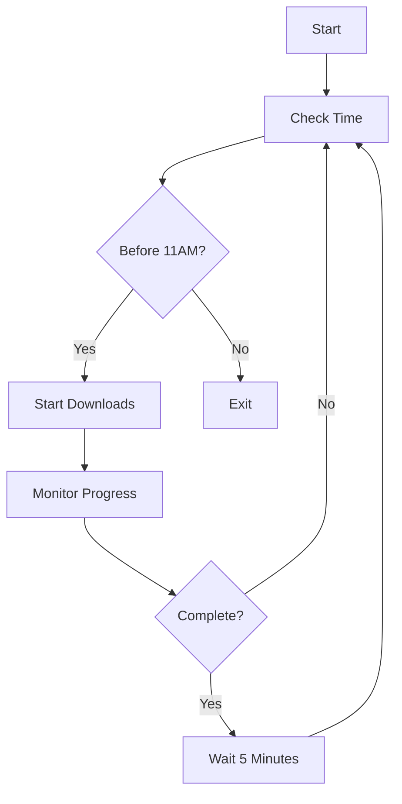

Here's the optimized `README.md` based on your actual script:

```markdown
# Automated Download Manager (aria2c + ProxyChains)


A robust Bash script for automated high-speed downloads through proxies with time-based execution control.

## Key Features ✨

- 🕒 **Time-Aware Execution**: Auto-terminates at 11:00 AM (configurable)
- 🔄 **Resumable Downloads**: Built-in retry mechanism with 5-minute intervals
- ⚡ **High Performance**: 16 parallel connections per download
- 📁 **Batch Processing**: Handles multiple URLs from a text file
- 🔒 **Proxy Support**: Seamless integration with ProxyChains
- 🛡️ **Safe Execution**: Automatic directory creation and input validation

## Prerequisites 📦

```bash
# Install required packages
sudo apt update && sudo apt install -y aria2 proxychains
```

## Usage 🚀

1. Prepare your URL list (`urls.txt`):
   ```text
   https://example.com/large-file.zip
   https://mirror.org/package.tar.gz
   ```

2. Run the script:
   ```bash
   chmod +x download_script.sh
   ./download_script.sh urls.txt /path/to/downloads
   ```

## Advanced Configuration ⚙️

### Proxy Setup (`/etc/proxychains.conf`):
```ini
socks5 127.0.0.1 9050  # Tor example
http 192.168.1.100 8080  # HTTP proxy example
```

### Script Options:
| Parameter          | Description                          | Default          |
|--------------------|--------------------------------------|------------------|
| `--split=N`        | Download connections per file       | 16               |
| `--max-tries=N`    | Maximum retry attempts              | 0 (infinite)     |
| `--timeout=SECONDS`| Network timeout                     | 60               |

## Cron Setup ⏰

```bash
# Open crontab editor
crontab -e

# Add line for daily execution at 1:00 AM
0 1 * * * /path/to/download_script.sh /path/to/urls.txt /path/to/downloads >> /var/log/downloader.log 2>&1
```

## Technical Details 🔍

### Process Flow:


### File Structure:
```
downloader/
├── download_script.sh    # Main script (make executable)
├── urls.txt             # URL list (one per line)
├── downloads/          # Default output directory
└── README.md           # This documentation
```

## Troubleshooting 🛠️

| Issue                  | Solution                              |
|------------------------|---------------------------------------|
| Proxy connection fails | Verify `/etc/proxychains.conf`        |
| SSL errors             | Remove `--check-certificate=false`    |
| Permission denied      | Run with `sudo` or fix permissions    |
| Incomplete downloads   | Check disk space and network stability|
